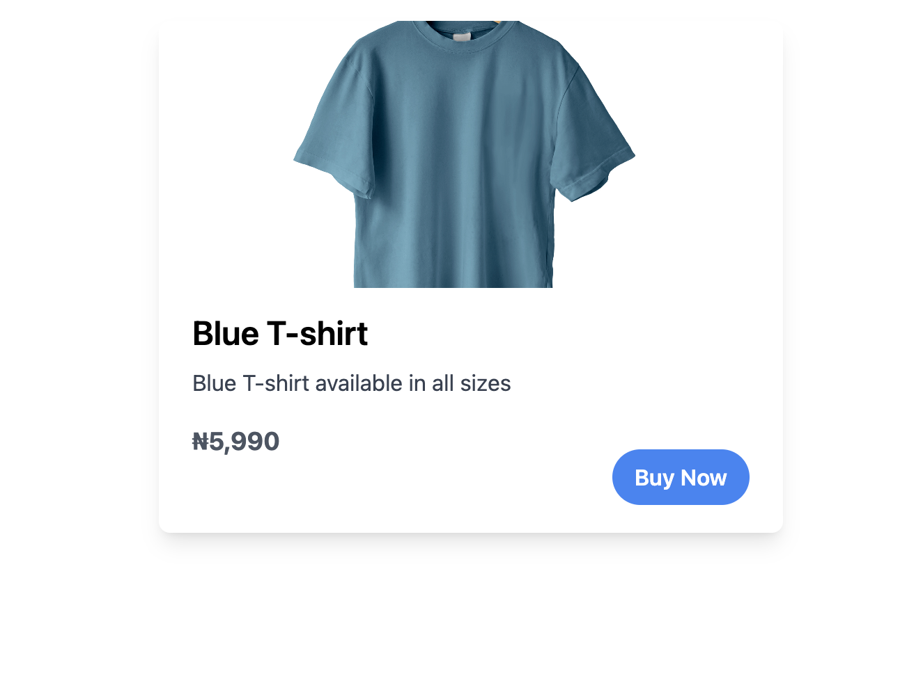

# Laravel Monnify Example App
This app illustrates how the Laravel Monnify Package works

## Usage
Install the package

``composer require triverla/laravel-monnify``

## Screenshots
#### Product Purchase Page

#### Monnify Payment Page

#### Payment Callback

